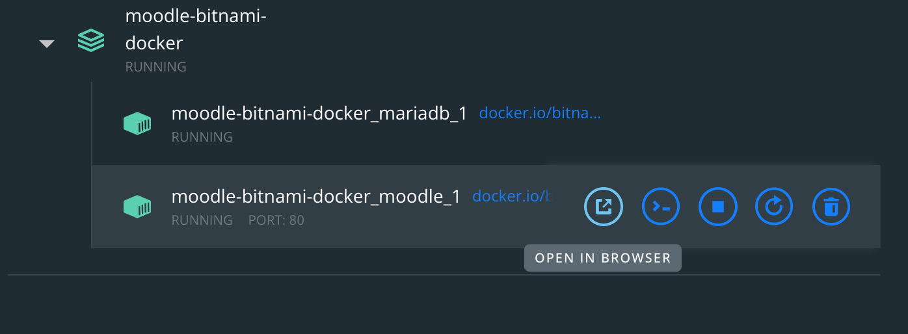

# Moodle

Moodle is an open-source learning platform designed to provide educators, administrators and learners with a single robust, secure and integrated system to create personalized learning environments. Moodle is free with no licensing fees. It is provided freely as Open Source software, under the GNU General Public License. Anyone can adapt, extend or modify Moodle for both commercial and non-commercial projects without any licensing fees and benefit from the cost-efficiencies, flexibility and other advantages of using Moodle.\[1]

### Moodle Documentation

The Moodle community maintains a comprehensive documentation site. You can find everything from basic hosting to advanced administration tools and theme development from this site.



### Moodle Docker Development Environment

This is a Docker-based Moodle Development Environment. This is useful for developing plugins and themes locally.



### Bitnami Moodle Docker Image

Docker Image that can be used for deploying to Cloud-based container orchestration services like Kubernetes and AWS Terraform.



### Setup Bitnami-Moodle-Docker Image

Refer to the url below for more info. It points to the TL;DR

[GitHub - bitnami/bitnami-docker-moodle: Bitnami Docker Image for Moodle](https://github.com/bitnami/bitnami-docker-moodle#tldr)


#### open the terminal/command-line and navigate to the root user folder or the folder where you want to hold the moodle-bitnami container data.

Either go to your root user directory or choose a different directory. See the link below for the pros and cons of each choice.

[Work With Non-Root Containers for Bitnami Applications](https://docs.bitnami.com/tutorials/work-with-non-root-containers/)

## Run the two commands below.

```bash
$ curl -sSL <https://raw.githubusercontent.com/bitnami/bitnami-docker-moodle/master/docker-compose.yml> > docker-compose.yml
$ docker-compose up -d
```

\<aside> 💡 **Warning**: This quick setup is only intended for development environments. You are encouraged to change the insecure default credentials and check out the available configuration options in the [Environment Variables](https://github.com/bitnami/bitnami-docker-moodle#environment-variables) section for a more secure deployment.

\</aside>


#### move the moodle folder into the directory where you ran `docker compose`.


#### Open a browser and navigate to localhost

#### or&#x20;

#### Use the docker desktop app (see image)



#### Login using username: `user` and password: `bitnami`

### References

1. [https://docs.moodle.org/311/en/About\_Moodle](https://docs.moodle.org/311/en/About\_Moodle)
