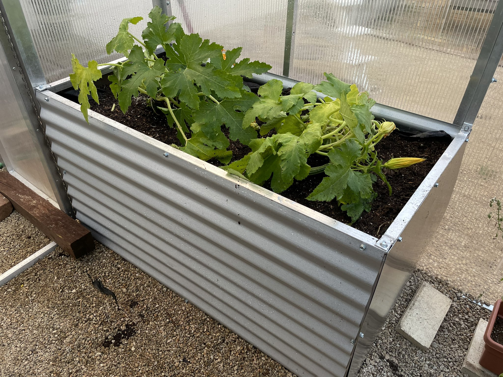

# Modular Greenhouses

## Introduction

SPEC is researching the application of modular greenhouse systems in urban and rural environments. The greenhouse system we are experimenting with was developed by [Modular Greenhouses](https://www.modulargreenhouses.com), based out of Reno, Nevada. The greenhouse design enables quick assembly and disassembly. The greenhouses are engineered for 100 mph wind and can support higher wind requirements over 100 mph and snow loads with an additional wind/snow kit. These greenhouses use an anchoring system to secure the structure to the ground. Check out this video from Modular Greenhouses demonstrating the ease of assembly.

Our goal is increase access to sustainable controlled environment agriculture technologies through the use modular construction systems and open source software/hardware. We want to drive costs down, share information, and provide training in agricultural technology and agribusiness.



## Construction

We purchased an 8' wide X 12' long modular greenhouse. The greenhouse cost $3,749.00. We have assembled the greenhouse backyard of our co-founder Joe Torreggiani in San Francisco, CA.

[🚧](https://emojipedia.org/construction/) Under Construction [🚧](https://emojipedia.org/construction/)

## Raised Beds

[🚧](https://emojipedia.org/construction/) Under Construction [🚧](https://emojipedia.org/construction/)

## Environmental Control System

[🚧](https://emojipedia.org/construction/) Under Construction [🚧](https://emojipedia.org/construction/)

## References

1. [https://www.modulargreenhouses.com](https://www.modulargreenhouses.com/video)
